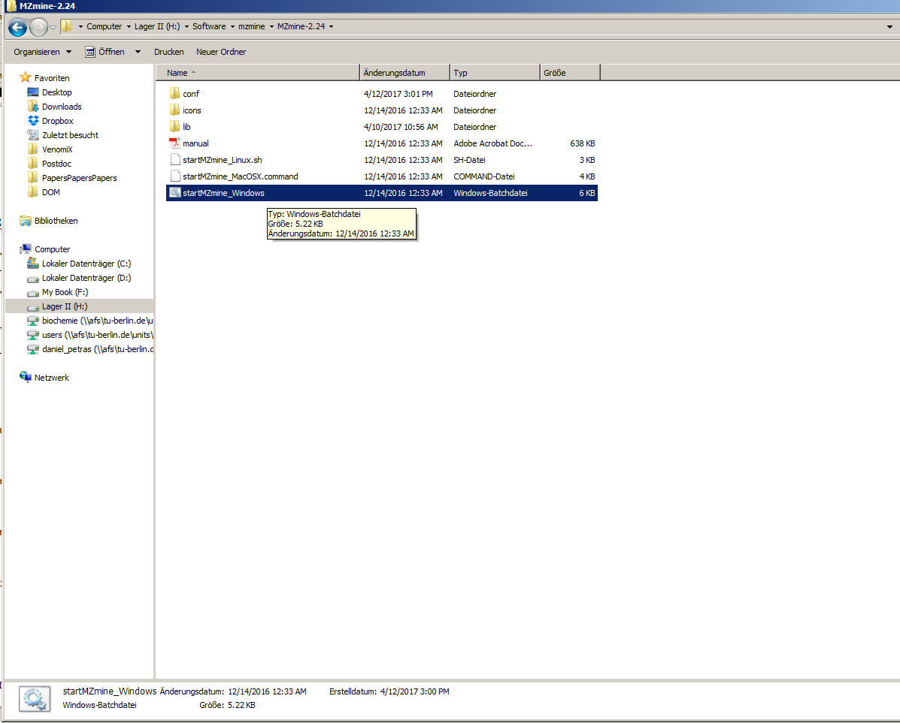
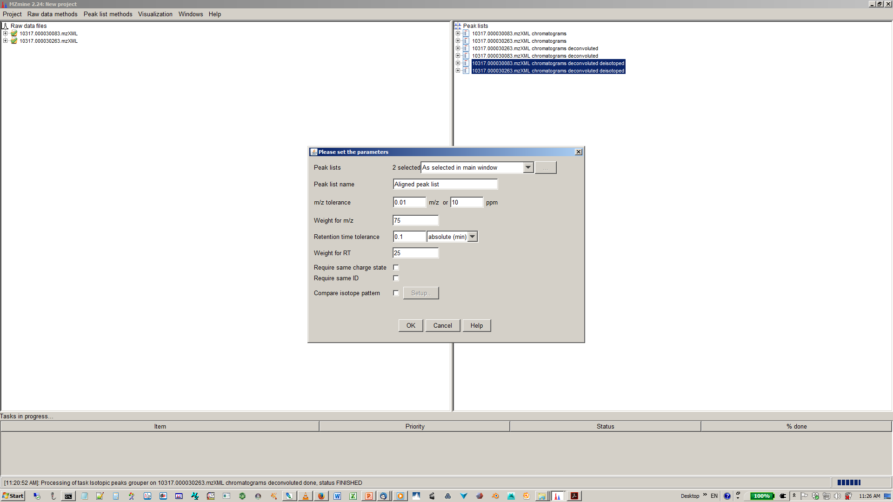
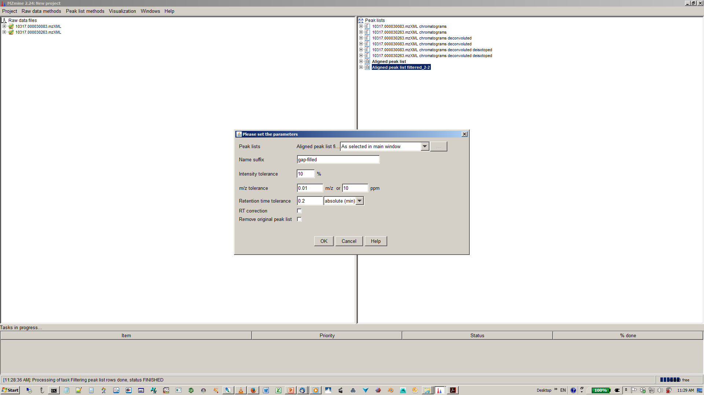
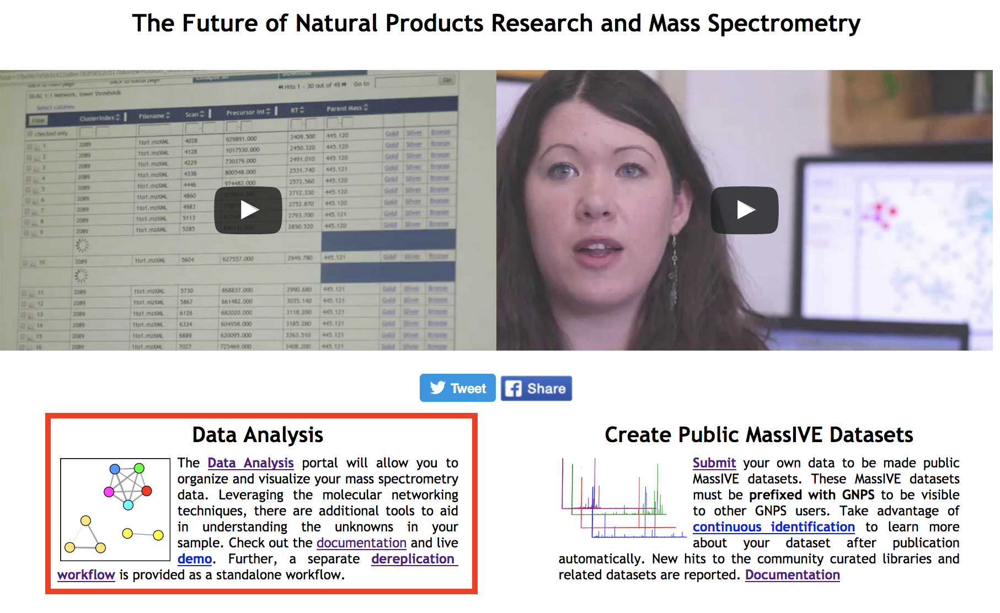
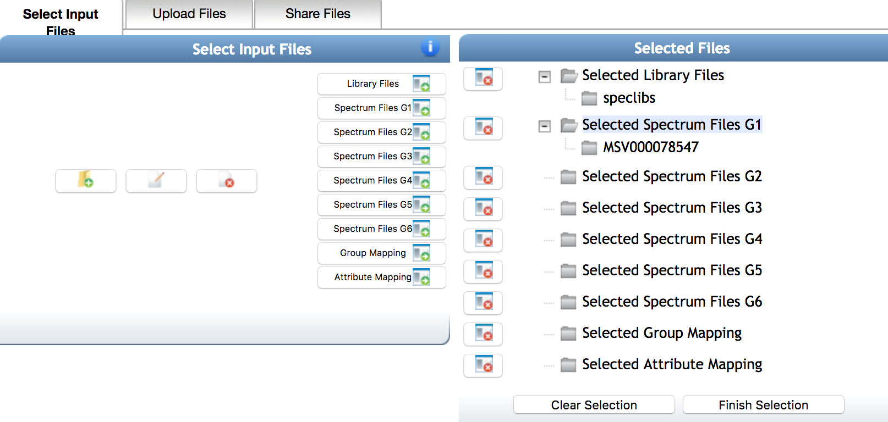

# Notes on metabolomics

Edited for the Dorrestein Lab by Louis-Felix Nothias, Daniel Petras and Ricardo Silva on December 2016. Last edit on April 2017. 

## About the metabolomics workshop
In the following documentation, we are providing step-by-step tutorials to perform basic analysis of liquid chromatography coupled to tandem mass spectrometry data (LC-MS/MS). These tutorials can be employed to process untargeted metabolomics data, such as those generated for seed funded project.
- The GNPS web-platform will be used to generate a qualitative analysis of your sample LC-MS/MS data. Such as the annotation of known compounds (by MS/MS spectral matching with public library), along as annotating unknown compounds by molecular networking (by spectral similarity).
- And we will used MZmine2 to process LC-MS/MS data in order to generate a feature table. This feature table contains the list of detected compounds and their relative distribution accross samples. This feature table will be used to generate statistical analysis in Qiita.

# Feature finding with MZmine2

 <b>Please follow this <a href="http://mzmine.github.io/download.html">(link)</a> to install the software and dependencies.</b>

## Complete workflow view

### **1.** Start mzMine2

### **2.** Click on raw data import in drop down menu and select .mzxml files

### **3.** Click on mass detection in drop down menu

### **4.** Specify intensity cut-off and mass list

### **5.** Build XICs with chromatogram builder

### **6.** Specify mass list, mass tolerance min. time span and min. hight

### **7.** Deconvolute isobaric peaks with chromatogram deconvolution

### **8.** Specify algorithm (base line cut-off or local minimum search and parmaters

### **9.** Perform deisotopization through isotope peak grouper

### **10.** Specify parameters for isotope peak grouping

### **11.** Align XICs from different sample to one matrix

### **12.** Specify join aligner parameters

### **13.** [optional] Filter aligned feature matrix with peak list row filter

### **14.** [optional] Depending of your experimental design use n minimum peaks in a row (n should be around the number of replicates or samples you expect to be similar) and 2-3 minimum peaks per isotope pattern

### **15.** [optional] You gap filling the re-analyses missed peaks and fill gaps in the feature matrix

### **16.** [optional] Depending on experimental design you can normalize your peak intensities to internal standards, TICs or total peak area.

### **17.** [optional] Specify normalization parameters

### **18.** Export your matrix as .csv file for down stream data analysis

### **19.** select file name and parameters you want to export

**Here is also a video for [MZmine 2 documentation](http://mzmine.github.io/):**

# Metabolomics demo data in Qiita
* Refer to the Qiita documentation about Principal Coordinates Analysis (PCoA) [here](http://cmi-workshop.readthedocs.io/en/latest/qiita-16S-analysis.html#s-microbiome-analysis-in-qiita)

# GNPS tutorial for MS/MS data annotation
Global Natural Products Social Molecular Networking [GNPS](http://gnps.ucsd.edu) web-platform provides public data set deposition and/or retrieval through the Mass Spectrometry Interactive Virtual Environment (MassIVE) data repository. The GNPS analysis infrastructure further enables online dereplication, automated molecular networking analysis, and crowdsourced MS/MS spectrum curation. Each data set added to the GNPS repository is automatically reanalyzed in the next monthly cycle of continuous identification.
For more information, please check out the GNPS paper published in Nature Biotechnology by Ming et al 2016 [here](https://www.ncbi.nlm.nih.gov/pubmed/27504778) as well as the video and the ressource on [Youtube](https://www.youtube.com/channel/UCufTdDIUPjfoN604Igv_29g), and well as on the online [documentation](https://bix-lab.ucsd.edu/display/Public/GNPS+Documentation+Page) 

### Tutorial:  Generation of Molecular Networks in 15 minutes: Exploring MS/MS data with the GNPS Data Analysis workflow

#### Step 1- Go to GNPS and create an account

Go to GNPS main page in an other window [http://gnps.ucsd.edu](http://gnps.ucsd.edu) and create your own account first (important!)

#### Step 2- Find a MS/MS dataset on MassIVE (Mass spectrometry Interactive Virtual Environment)

**A)** Go to [GNPS](http://gnps.ucsd.edu) and access the MassIVE datasets repository.

**B)** Search for the MassIVE datasets named "GNPS Workshop" (or "GNPS_AMG_SeedGrant" for a larger example with American Gut Projects samples).Explore its content, and copy the MassIVE ID number (MSV)

**Note:** If you want to upload your own data, follow the [DorresteinLab youtube chanel](https://www.youtube.com/channel/UCufTdDIUPjfoN604Igv_29g), here is the video:

#### Step 3 - Access to the Data Analysis workflow

Go to back [GNPS main page](http://gnps.ucsd.edu) and open the Data Analysis workflow.

#### Step 4 - Configure and launch the Data Analysis workflow

**A)** Indicate a Title.

**B)** Clic on Spectrum Files (required) 

**C)** Go to the Share Files spreadsheet and import the Massive dataset files for the "GNPS workshop" or "GNPS_AMG_SeedGrant" with the Import Data Share (use the MassIVE ID).

**D)** Go back to the Select Input Files spreadsheet.

**E)** Add the files from the imported datasets "GNPS_AMG_SeedGrant" into Spectrum Files G1.

**F)** Validate the selection with Finish Selection button.

**G)** Modifiy parameters to meet high-resolution mass spectrometry: Precursor Ion Mass Tolerance (0.02), Fragment Ion Mass Tolerance (0.02), Min Pairs Cos (0.6), Minimum Matched Fragment Ions (2), Minimum cluster size (use 1)

**H)** Launch the Data Analysis workflow using the Submit button.

#### Step 5 - Visualize the Data Analysis workflow output

**A)** Return to [GNPS main page](http://gnps.ucsd.edu) and go to the Jobs page. Please find [here](http://gnps.ucsd.edu/ProteoSAFe/status.jsp?task=5b40ac0ce8194383a258ea85890ad301) an example of GNPS data analysis output with American Gut Project.

**B)** Explore the molecule annotated using public spectral library available on GNPS. Click on [View All Library Hits](http://gnps.ucsd.edu/ProteoSAFe/result.jsp?task=5b40ac0ce8194383a258ea85890ad301&view=group_by_compound).

**C)** Go back to the [Status Page](http://gnps.ucsd.edu/ProteoSAFe/status.jsp?task=5b40ac0ce8194383a258ea85890ad301)

**D)** Clic on the [View Spectral families](http://gnps.ucsd.edu/ProteoSAFe/result.jsp?task=5b40ac0ce8194383a258ea85890ad301&view=network_components) and visualize the [molecular network 1](http://gnps.ucsd.edu/ProteoSAFe/result.jsp?view=network_displayer&componentindex=3&task=5b40ac0ce8194383a258ea85890ad301#%7B%7D)

**E)** In Node Labels (bottom left), map the parent mass, or the LibraryID, in the molecular network.

**F)** Visualize a first MS/MS spectrum by left-clicking on one node. Visualize a second MS/MS spectrum by right-clicking on a second node.

**More on navigating into the results with the following video:**

