# Feature finding with MZmine2

 <b>Please follow this <a href="http://mzmine.github.io/download.html">(link)</a> to install the software and dependencies.</b>

## Complete workflow view

### **1.** Start mzMine2

### **2.** Click on raw data import in drop down menu and select .mzxml files

### **3.** Click on mass detection in drop down menu
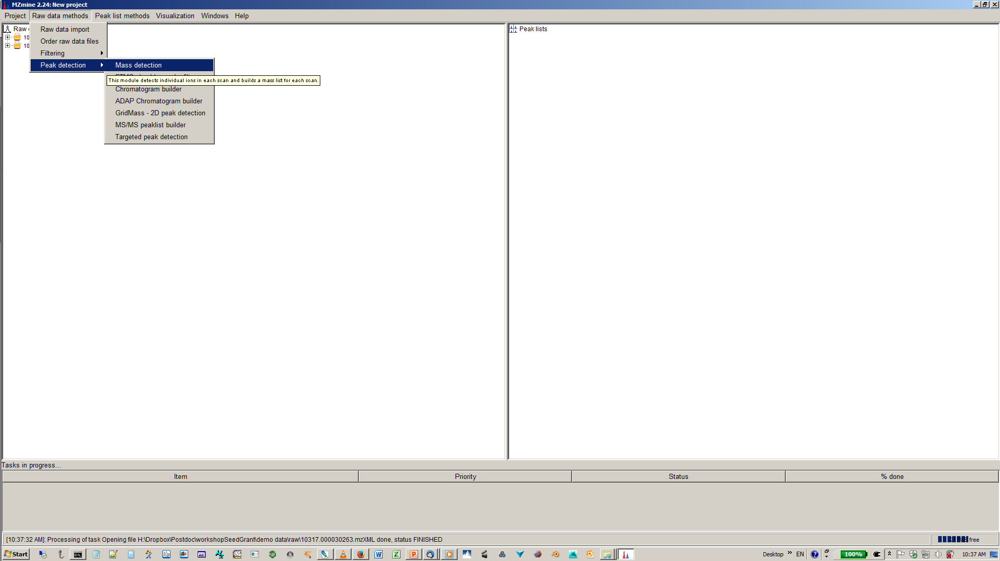

### **4.** Specify intensity cut-off and mass list
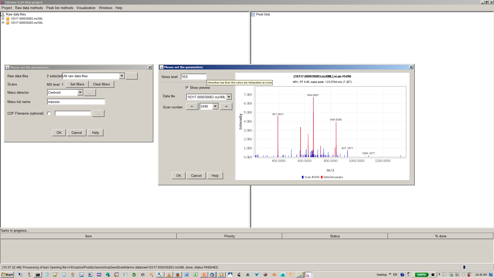

### **5.** Build XICs with chromatogram builder
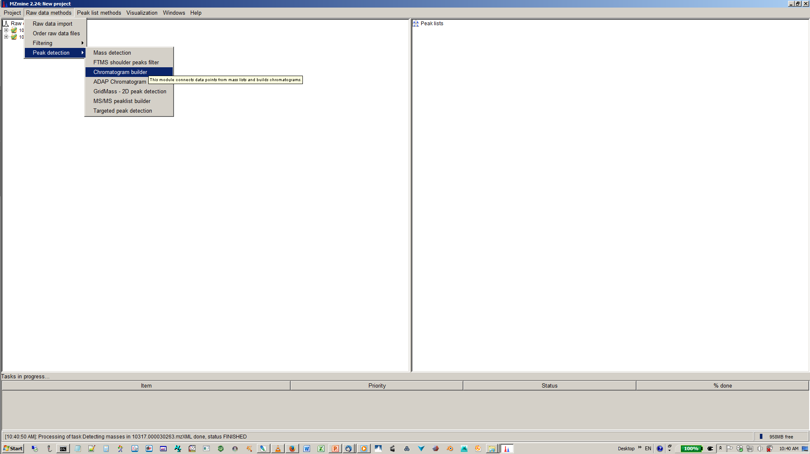

### **6.** Specify mass list, mass tolerance min. time span and min. hight
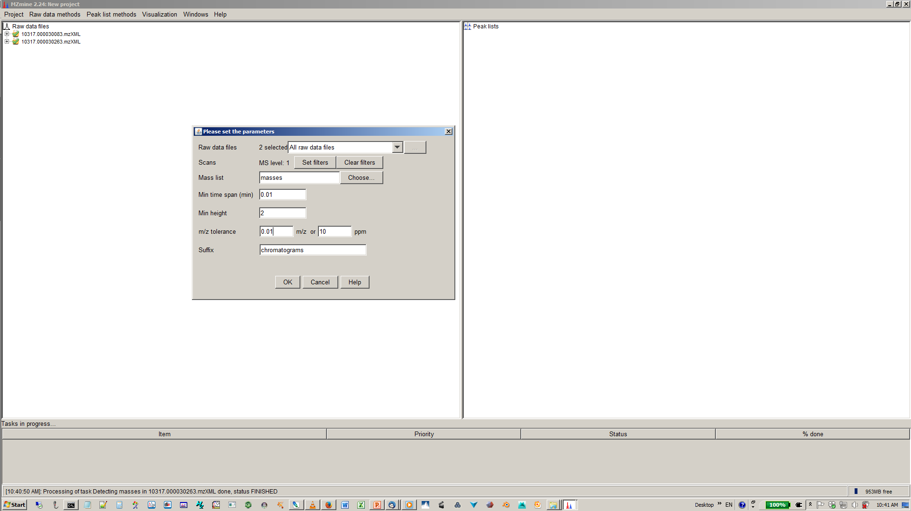

### **7.** Deconvolute isobaric peaks with chromatogram deconvolution

### **8.** Specify algorithm (base line cut-off or local minimum search and parmaters
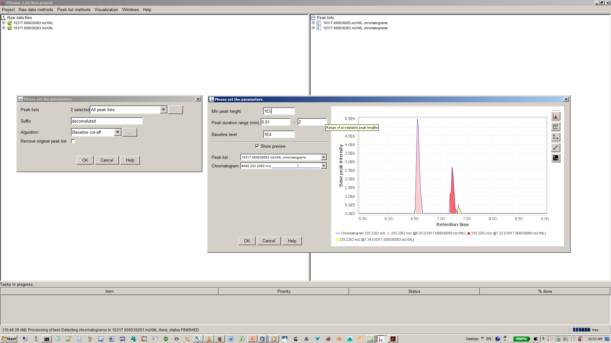

### **9.** Perform deisotopization through isotope peak grouper
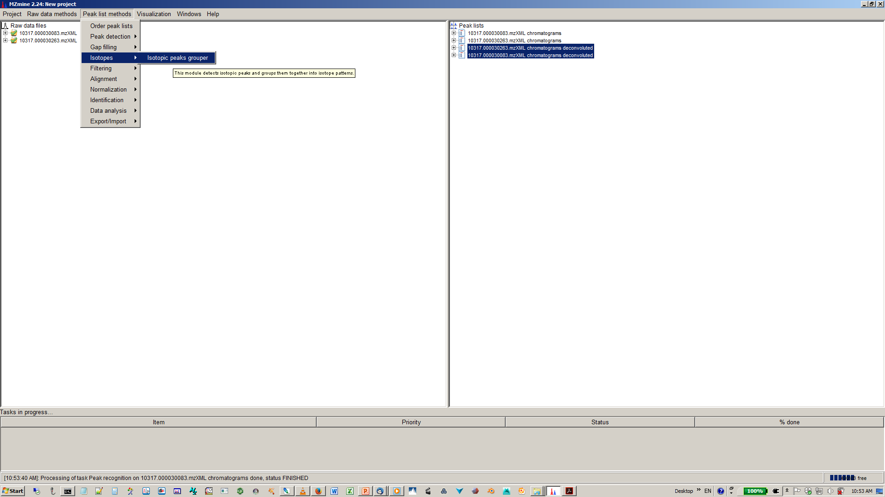

### **10.** Specify parameters for isotope peak grouping
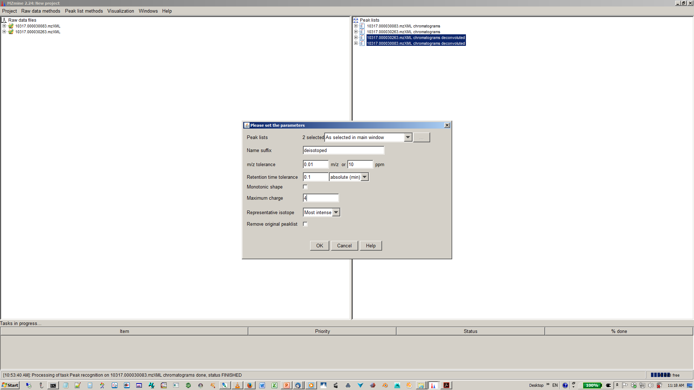

### **11.** Align XICs from different sample to one matrix
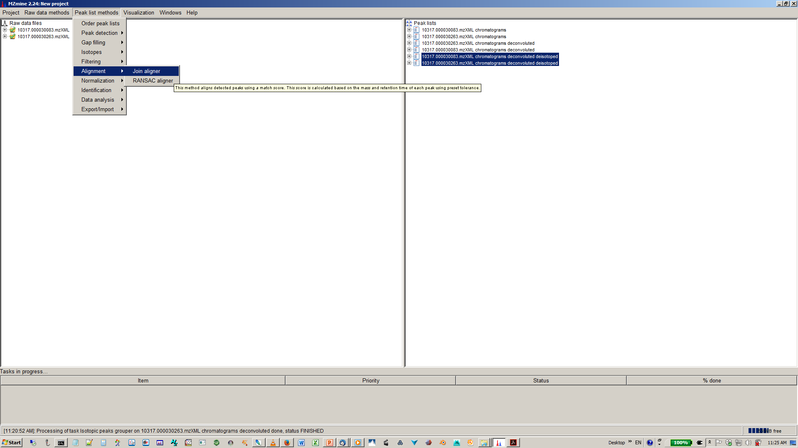

### **12.** Specify join aligner parameters

### **13.** [optional] Filter aligned feature matrix with peak list row filter

### **14.** [optional] Depending of your experimental design use n minimum peaks in a row (n should be around the number of replicates or samples you expect to be similar) and 2-3 minimum peaks per isotope pattern
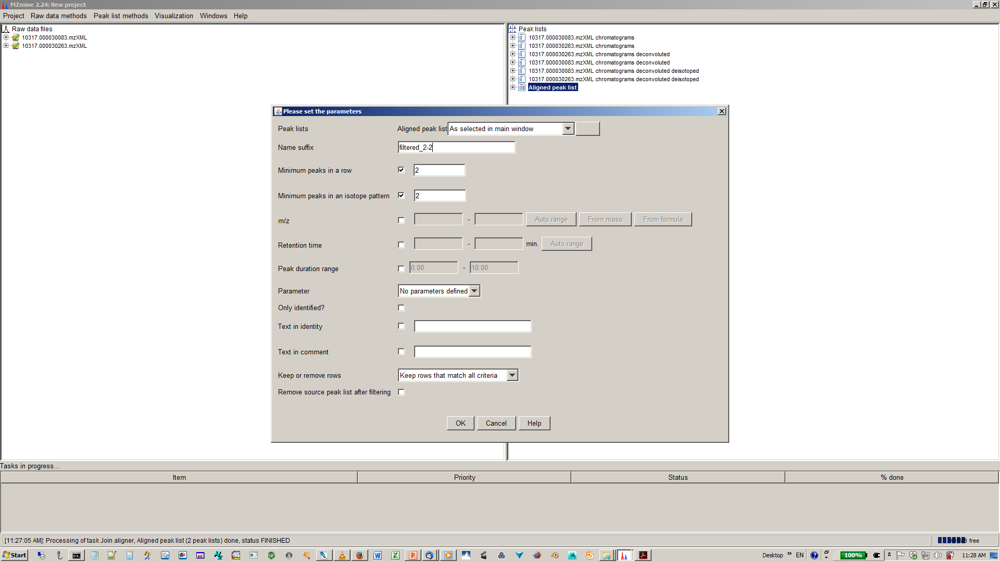

### **15.** [optional] You gap filling the re-analyses missed peaks and fill gaps in the feature matrix
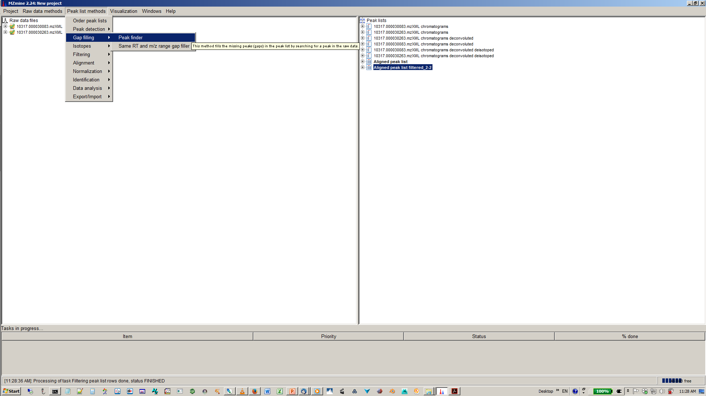

### **16.** [optional] Depending on experimental design you can normalize your peak intensities to internal standards, TICs or total peak area.

### **17.** [optional] Specify normalization parameters

### **18.** Export your matrix as .csv file for down stream data analysis

### **19.** select file name and parameters you want to export
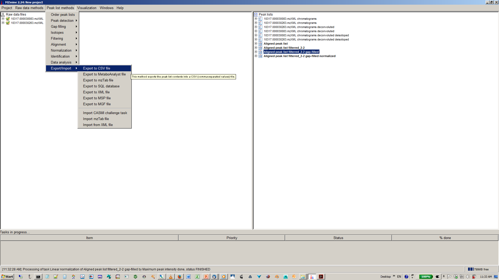

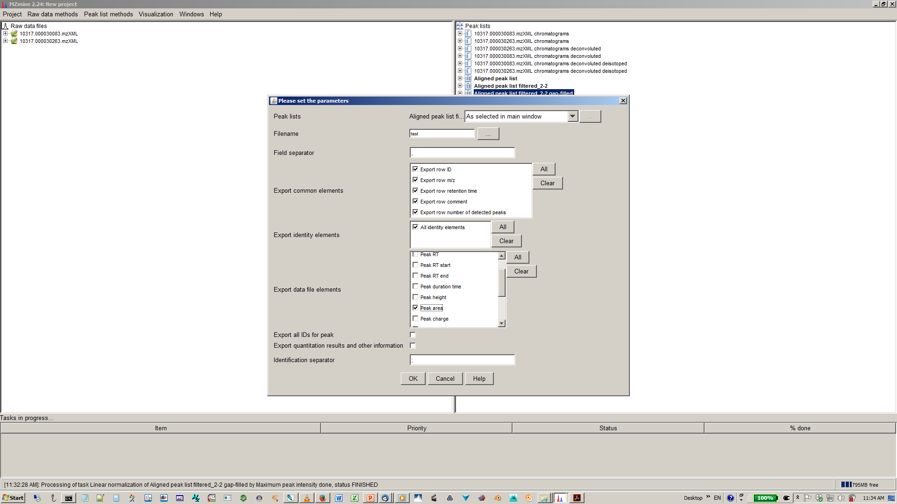

**Here is also a video for [MZmine 2 documentation](http://mzmine.github.io/):**

